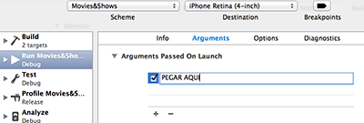

#README
===
Aplicacion de prueba para asentar diferentes conceptos como el uso de librerias como Mantle, AFNetworking y SDWebImage y varios patrones de diseño como `strategy` con el fin de mostrar diferentes UITableViewCell custom en la app y `facade` para sincronizar y descargar todos los recursos de la red. 

Se ha usado como fuente de peliculas y series la API gratuita de trakt.tv (mas abajo en recursos). `Si quereis ejecutar este codigo NECESITAREIS registraros para obtener vuestra clave privada`. Seguir las instrucciones de abajo para hacerlo funcionar. 

##Importante para que funcione.
___

La app esta pensada para recibir la clave privada como primer argumento al iniciarse. Esto se puede hacer en 3 sencillos pasos:

1. Primero conseguir la clave privada que nos de acceso al API. Ir a [trakt.tv](http://trakt.tv/) registraros (es gratis) y en Settings>API. Copiarla al portapapeles. 
2. Una vez que teneis vuestra API nos descargamos este proyecto de xcode y lo abrimos. `¡ANTES DE EJECUTAR NADA!` Pinchar sobre el Scheme actual > Edit Scheme   

3. Y dentro de la nueva ventana que se ha abierto. Añadimos nuestra clave privada como primer argumento de la aplicacion.   

4. `¡EJECUTAR!`

##Recursos:
___
* [trakt.tv](http://trakt.tv/) - API publica gratuita con datos sobre las peliculas/series
* **AFNetworking** - Framework para manejar las peticiones a la API. (Instalado desde CocoaPods)
* **Mantle** - Framework para parsear los JSON que nos devuelve la API. (Instalado desde CocoaPods)
* **SDWebImage** - Framewokr para descagar las imagenes de cada serie/pelicula y cachearlas en local. (Instalado desde CocoaPods). 

